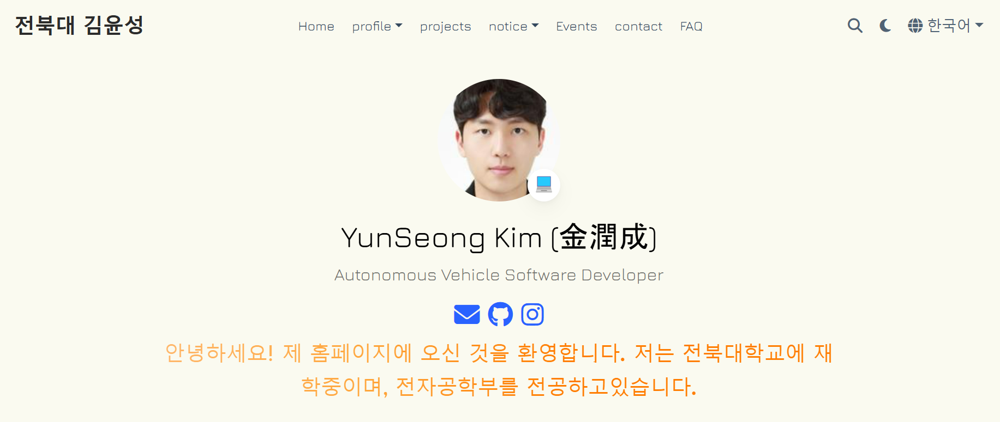

# [SeoHyeon Portpolio](https://imsh429.github.io/)

Welcome to the **personal portfolio of 신서현**, a junior developer currently studying computer and artificial intelligence at Jeonbuk National University. This website showcases my projects, including modifications to the CookieRun game, a cosmetics semantic search system, and recommendation systems. You can find more about my skills, experience, and projects in the portfolio section.

-  **Profile** : [**About Me**](https://imsh429.github.io/about/), [**Interests**](https://imsh429.github.io/interests/)
-  [**Projects**](https://imsh429.github.io/project/)
-  **notice** : [**News**](https://imsh429.github.io/notice/), [**Gallery**](https://imsh429.github.io/gallery/)

- If you have any questions, or need any help, [**Contact**](https://imsh429.github.io/contact/) me or leave [**FAQ**](https://imsh429.github.io/faq/) messages
